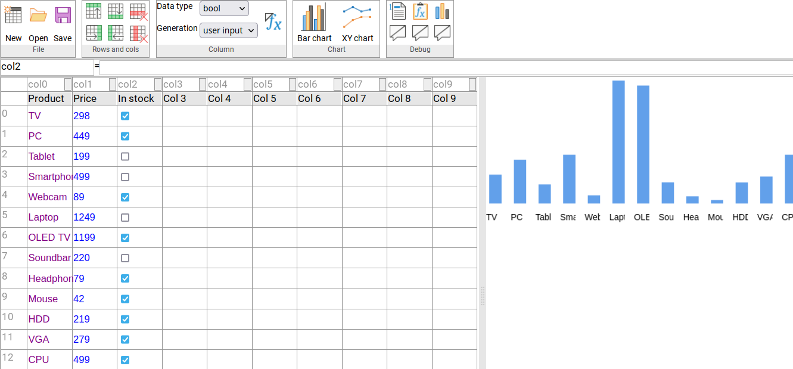

# Spreadsheet editor backend
This is a homework project that recreates an website similar to Google Sheets, e.g. an online spreadsheet editor.

# Technologies used
- Java
- Spring Boot
- MongoDB via Docker

